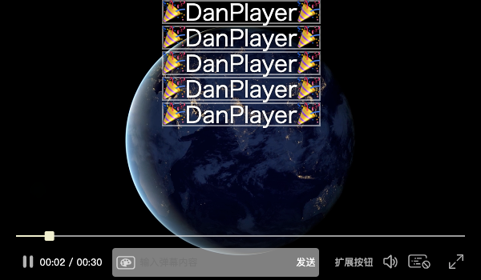

# 弹幕播放器 [Demo体验](https://gzlock.github.io/danplayer)

* 请以最终实际使用效果为准。

### 功能简介：

- 使用Canvas绘制弹幕
- 支持的自定义设置
    - 播放器的高亮颜色
    - 播放器右下角的功能按钮
    - 弹幕右键菜单的功能按钮
    - 普通/直播 视频模式
    - 开/关 全屏功能
    - 开/关 底部控制栏中间的发弹幕功能区域
    - 显示/隐藏 全部弹幕
    - 弹幕全局透明度
    - 弹幕的全局字体大小
    - 流动式弹幕的移动速度(从右到左移动的弹幕)
    - 固定式弹幕的隐藏时间(固定在视频顶部和底部的弹幕)
    - 设置弹幕显示的区域，效果接近B站的相关设置(完善中)
    - 控制栏的发弹幕的[发送]按钮，点击后会触发player设置参数的beforeSendDanmaku**异步函数**
        * 函数逻辑可以是提交弹幕内容到服务器
        * 返回true，会渲染这次发送的弹幕到屏幕
        * 返回false，则不渲染这次发送的弹幕到屏幕
- 支持的视频格式：
    - 优先检测浏览器能否原生支持播放，例如mp4视频文件，mp3音频文件
    - 当浏览器不支持HLS视频(例如Chromium系列)，则使用[hls.js](https://github.com/video-dev/hls.js)
    - 当浏览器不支持MPD视频(大部分浏览器都不支持)，则使用[dash.js](https://github.com/Dash-Industry-Forum/dash.js)

# [使用指南请参阅Wiki](https://github.com/gzlock/danplayer/wiki)

# 特别鸣谢
暂无

